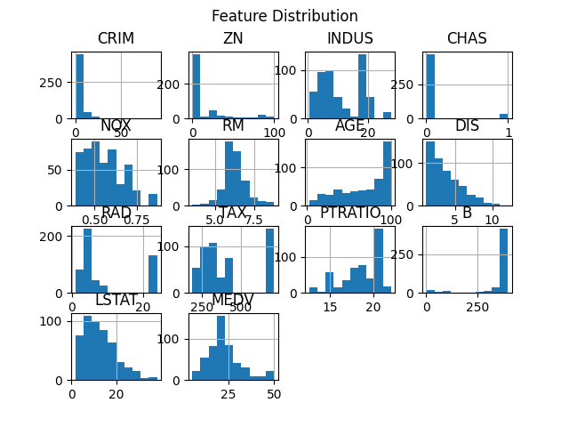
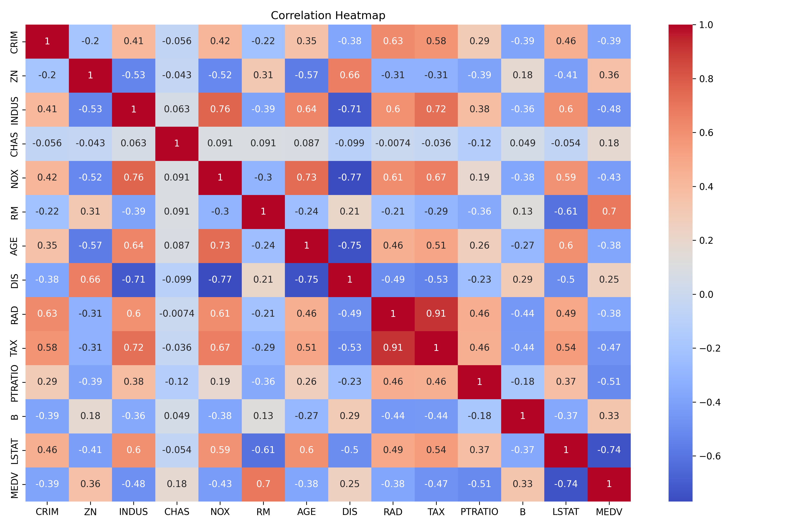
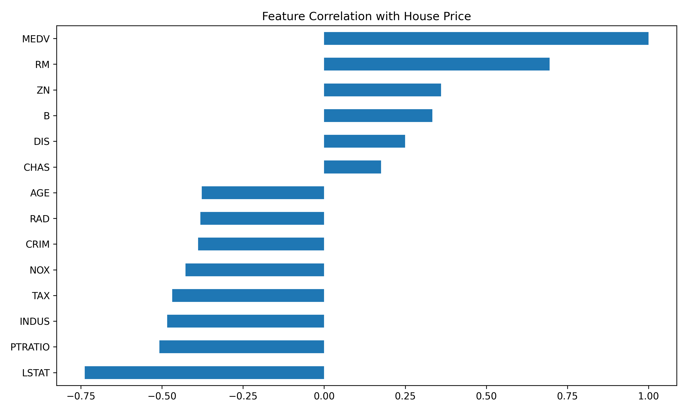
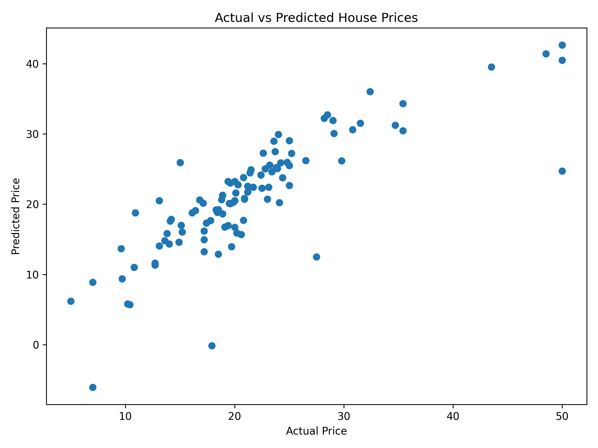

# Housing Price Analysis 🏡

## Project Overview
This project performs **data analysis and price prediction** on a housing dataset using Python.  
The goal is to understand how different features affect house prices and build a **Linear Regression model** to predict housing prices.

---

## Technologies Used
- Python
- Pandas
- NumPy
- Matplotlib
- Seaborn
- Scikit-Learn

---

## Dataset
The dataset contains housing information such as:

- Crime rate (CRIM)
- Residential land zone (ZN)
- Number of rooms (RM)
- Property tax rate (TAX)
- Pupil-teacher ratio (PTRATIO)
- Lower status population (LSTAT)
- Median house value (MEDV)

These features help predict the **housing price**.

---

# Data Visualizations

### Histogram Graph

### Correlation Heatmap

### Feature Correlation with Price

### Actual vs Predicted Prices

---

# Machine Learning Model

We used **Linear Regression** to train the model.

### Model Evaluation

R² Score: **0.66**  
Mean Squared Error: **24**

The model explains around **66% of the variance in housing prices**.

---

# Project Structure
Housing_Price_Analysis
│
├── analysis.ipynb
├── README.md
├── 4) house Prediction Data Set.csv
│
└── graphs
├── heatmap.png
├── histogram.png
├── correlation.png
└── prediction.png

---

# Author

**Jaya Sri Palli**

Data Analytics Internship Project
